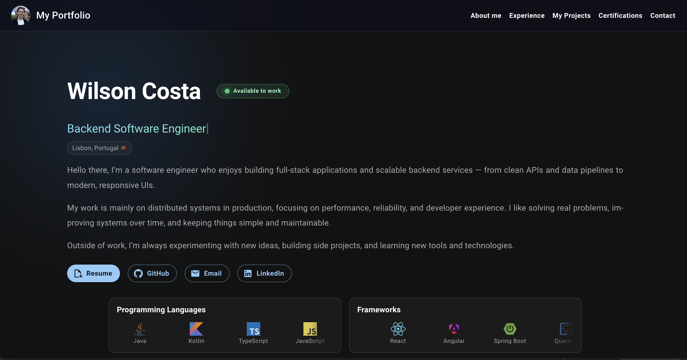

# Portfolio — Wilson Costa



Personal portfolio website built to showcase my projects, work experience, and certifications.

## 🌍 Live Demo

- **Website:** https://wilsoncosta-portfolio.vercel.app

## ✨ Features

- Minimal and responsive UI (desktop + mobile)
- Hero section with typing role animation
- Projects showcase with 3D tilt hover effect
- Work experience section with impact-focused bullet points
- Certifications section with downloadable PDFs
- Contact form (mailto)
- Smooth scrolling navigation

## 🛠 Tech Stack

- **React**
- **Vite**
- **TypeScript**
- **Material UI (MUI)**

## 🚀 Getting Started

### 1) Install dependencies

```bash
  npm install
```

### 2) Run locally

```bash
  npm run dev
```

### 3) Build for production

```bash
  npm run build
```

### 4) Preview production build

```bash
  npm run preview
```

## 📬 Contact

If you’d like to reach out, feel free to connect via:

- **GitHub**: https://github.com/WilsonRCosta
- **LinkedIn**: https://www.linkedin.com/in/wilson-costa-9a6b96159/
- **Email**: wilson.ruben97@gmail.com
